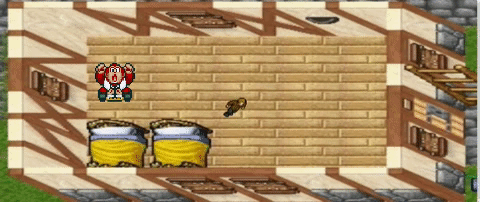

# Desafio CITi-PTA para ingresso na EJ

## 1. Objetivo

- [X] Implementar o movimento de um elemento **HTML/CSS**.
- [X] Implementar uma colisão!
- [X] Fazer o jogo com **PURO** Javascript!

## 2. Demonstração da Movimentação!

   

>Lembrando que é emitido sons de passos enquanto o personagem se movimenta.

## 3. Demonstração da Colisão!

    

>O jogo emite sons quando o personagem bate na parede, indicando que ele não vai conseguir passar daquele obstáculo! ~~CUIDADO PARA NãO SE ASSUSTAR!~~
